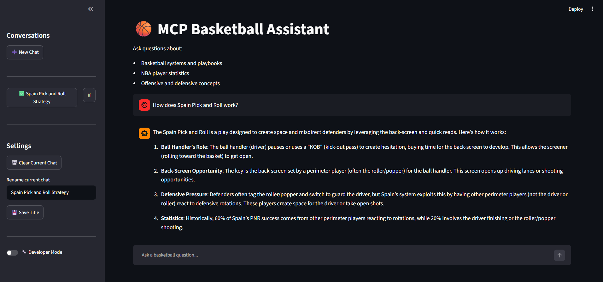
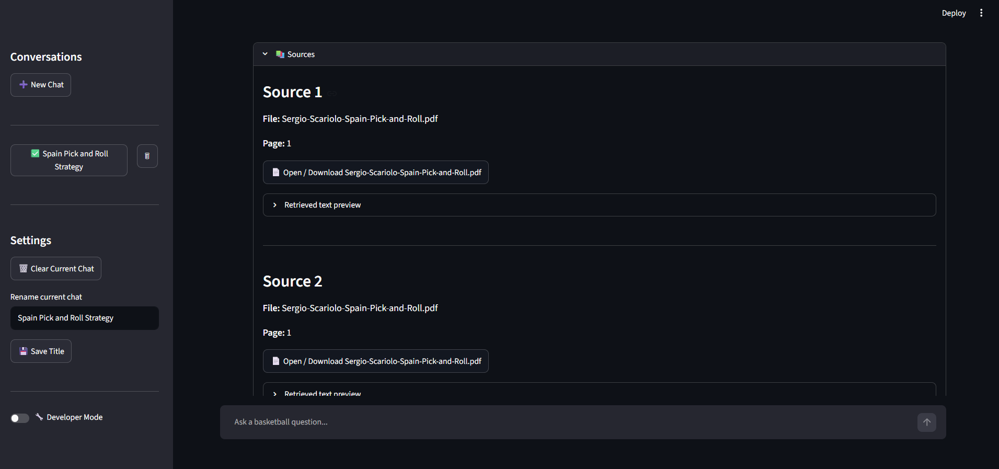

# MCP Basketball Assistant 🏀

An AI-powered Basketball Assistant built as a learning project to explore modern AI Agent architectures using MCP (Model Context Protocol), LangGraph, RAG, Hybrid Search, and Text-to-SQL.

The primary goal of this project was to gain hands-on experience with:

- **MCP** (Model Context Protocol)
- **LangGraph Agents**
- **Retrieval-Augmented Generation** (RAG)
- **Text-to-SQL Systems**
- Local **LLM** Inference with Ollama
- Agent **Evaluation** & Observability
- Multi-tool **Routing** Architectures

Rather than building a production application, this project was designed as an end-to-end AI engineering playground for understanding how modern agent systems are constructed.


---

# Learning Objectives

This project was created to learn and experiment with:

- Building custom MCP Servers and Clients
- Creating AI tools exposed through MCP
- Designing LangGraph agent workflows
- Implementing Retrieval-Augmented Generation (RAG)
- Building Text-to-SQL pipelines
- Understanding multi-tool routing
- Evaluating retrieval quality
- Evaluating query rewriting
- Working with local open-source LLMs
- Building complete AI applications from scratch

---

# Project Overview

The assistant combines two independent knowledge systems:

## 1. Basketball Knowledge Base (RAG)

Answers questions about:

- Spain Pick & Roll
- Flex Offense
- 5-Out Motion Offense
- Davidson Motion Offense
- Basketball Terminology
- Coaching Concepts
- Set Plays
- Offensive Actions

Example questions:

- How does Spain Pick and Roll work?
- What are its advantages?
- What is a DHO?
- Explain a flare screen.
- What is a Horns offense?

---

## 2. NBA Statistics Database (Text-to-SQL)

Answers questions about:

- NBA player statistics
- Team statistics
- Rankings
- Comparisons

Example questions:

- Who leads the league in assists?
- Top 10 players by points.
- Compare Jokic and Doncic.
- Which players average over 25 PPG?

---

# High-Level Architecture

```text
                     User Question
                            │
                            ▼
                    LangGraph Agent
                            │
                ┌───────────┴───────────┐
                ▼                       ▼
           RAG Pipeline            SQL Pipeline
                │                       │
                ▼                       ▼
         MCP RAG Tool            MCP SQL Tool
                │                       │
                └───────────┬───────────┘
                            ▼
                      Final Answer
```

---

# Agent Workflow

```text
User Question
        │
        ▼
Question Rewriter
        │
        ▼
Rule-Based Router
        │
        ▼
LLM Router (Fallback)
        │
   ┌────┴────┐
   ▼         ▼
  RAG       SQL
   │         │
   ▼         ▼
 MCP Tool  MCP Tool
   │         │
   └────┬────┘
        ▼
 Final Answer
```

---

# RAG Pipeline

The Retrieval-Augmented Generation system consists of:

```text
PDF Playbooks
      │
      ▼
    OCR
      │
      ▼
Semantic Chunking
      │
      ▼
Embeddings
      │
      ▼
ChromaDB
      │
      ▼
Hybrid Retrieval
(Vector + BM25)
      │
      ▼
Cross Encoder Reranker
      │
      ▼
Qwen3:8B
      │
      ▼
Answer
```

---

# Retrieval Architecture

The retrieval layer uses Hybrid Search:

### Dense Retrieval

- BAAI/bge-small-en-v1.5
- ChromaDB

### Sparse Retrieval

- BM25

### Re-ranking

- cross-encoder/ms-marco-MiniLM-L-6-v2

Pipeline:

```text
Query
 │
 ├── Dense Search (Chroma)
 │
 ├── BM25 Search
 │
 ▼
 Merge Results
 │
 ▼
 Cross Encoder Reranker
 │
 ▼
 Top-K Chunks
```

---

# Text-to-SQL Pipeline

```text
User Question
        │
        ▼
Qwen3:8B
        │
        ▼
SQL Query Generation
        │
        ▼
SQLite Database
        │
        ▼
Query Execution
        │
        ▼
Final Answer
```

---

# MCP Integration

The project implements both:

### MCP Server

Provides:

- Basketball Playbook Search Tool
- Basketball QA Tool
- NBA Statistics Tool

### MCP Client

Responsible for:

- Tool discovery
- Tool execution
- Persistent MCP sessions

---

# LangGraph Features

Implemented:

- Multi-node workflow
- Question rewriting
- Multi-turn conversations
- Rule-based routing
- LLM fallback routing
- MCP tool integration
- Observability & timing tracking

---
# Demo 

## Main Interface 



## Sources 



## SQL 


---
# End-to-End Evaluation

## Query Rewriting

Example:

Input:

```text
How does Spain Pick and Roll work?
```

Follow-up:

```text
What are its advantages?
```

Rewritten Query:

```text
What are the advantages of Spain Pick and Roll?
```

Result:

✅ Correct standalone question generation

---

## Router Evaluation

| Question | Expected Route | Predicted Route |
|-----------|-----------|-----------|
| How does Spain Pick and Roll work? | RAG | RAG |
| What is a DHO? | RAG | RAG |
| Top 10 players by assists | SQL | SQL |
| Compare Jokic and Doncic | SQL | SQL |

Current Accuracy:

```text
100%
```

---

## Retrieval Evaluation

```text
Questions: 14
Hit@5: 1.00
Text Hit@5: 1.00
MRR: 0.917
```

---

## Text-to-SQL Evaluation 

Keyword-based evaluation checking whether the generated natural language answer contains the expected player names / teams.

```commandline
Questions: 8
Correct: 8
Accuracy: 1.00
```

Example:
```commandline
Question: Who has the most rebounds?
Answer: Domantas Sabonis has the most rebounds.
```

--- 

## Performance

Current Average Timings:

```text
Question Rewrite: ~0.2s
Routing: ~0.1s
Hybrid Retrieval: ~0.3s
Answer Generation: ~16s
Total: ~16.5s
```

---

# Performance Optimizations

Implemented:

- Model caching
- Chroma collection caching
- BM25 caching
- Cross-encoder caching
- Persistent MCP sessions
- Streamlit warm-up loading

Example:

```text
Retrieval Latency

Before:
~20 seconds

After:
~0.3 seconds
```

---

# User Interface

Built with Streamlit.

Features:

- Multi-chat support
- Conversation persistence
- Conversation renaming
- Source inspection
- PDF downloads
- Suggested prompts
- Developer mode
- Agent observability

---

# Technologies

## Agent Framework

- LangGraph
- MCP

## LLM

- Ollama
- Qwen3:8B

## Retrieval

- ChromaDB
- Sentence Transformers
- BM25
- Cross Encoders

## Data Processing

- PyMuPDF
- EasyOCR
- NumPy

## Database

- SQLite
- Pandas
- nba_api

## UI

- Streamlit

---

# Project Structure

```text
app/

├── graph/
│   ├── agent.py
│   └── mcp_client.py
│
├── mcp/
│   ├── server.py
│   └── test_client.py
│
├── rag/
│   ├── pdf_ocr_loader.py
│   ├── semantic_chunker.py
│   ├── build_vector_db.py
│   ├── retriever.py
│   ├── bm25_retriever.py
│   ├── reranker.py
│   └── answer_generator.py
│
├── sql/
│   ├── build_nba_db.py
│   ├── sql_executor.py
│   └── text_to_sql.py
│
└── ui/
    ├── chat_app.py
    └── conversation_manager.py
```

---
# Installation

## Clone Repository

```bash
git clone https://github.com/dimitrisl99/mcp-langgraph-basketball-agent.git
cd mcp-langgraph-basketball-agent
```

## Create Virtual Environment

```bash
python -m venv .venv
```

Windows:

```bash
.venv\Scripts\activate
```
Linux / Mac:

```bash
source .venv/bin/activate
```

## Install Dependencies

```bash
pip install -r requirements.txt
```

---

# Ollama Setup

Install Ollama:

https://ollama.com

Pull the model:

```bash
ollama pull qwen3:8b
```

Verify:

```bash
ollama run qwen3:8b
```

---


# Build the Knowledge Base

## OCR Processing

```bash
python app/rag/pdf_ocr_loader.py
```

## Semantic Chunking

```bash
python app/rag/semantic_chunker.py
```

## Build Vector Database

```bash
python app/rag/build_vector_db.py
```

---

# Build NBA Database

```bash
python app/sql/build_nba_db.py
```

---

# Run Application

```bash
streamlit run app/ui/chat_app.py
```

---

# Design Decisions

Some notable design choices:

- MCP was used to decouple tools from the agent.
- Hybrid Search combines semantic and lexical retrieval.
- Cross-encoder reranking improves retrieval precision.
- Query rewriting improves multi-turn conversations.
- Rule-based routing is used before LLM routing to reduce latency and cost.
- Persistent MCP sessions reduce startup overhead.

---

# Known Limitations
- Answer generation latency: ~16s per RAG answer, since the local qwen3:8b model runs without GPU-optimized streaming. Streaming was evaluated but rejected because it only improves perceived latency, not actual response time, given the current MCP-based architecture.
- Text-to-SQL evaluation is keyword-based: it checks whether expected entities (player names, teams) appear in the final answer, but does not validate numeric correctness. A comparison query was found to occasionally mix up which value belongs to which player, which this evaluation method would not catch. A stricter, value-based evaluation is a planned improvement.
- OCR-based PDF ingestion requires a GPU for reasonable processing speed; on CPU-only machines, building the knowledge base from scratch can be slow.
- NBA statistics are static, pulled once for a single season (2024-25) and stored in SQLite. The data is not automatically refreshed.
- No persistence of vector/BM25 indices across schema changes — if the chunking strategy changes, the Chroma DB must be rebuilt from scratch.

---
# Future Improvements

Potential next steps:

- Streaming responses
- Memory persistence
- Agent evaluation benchmarks
- RAGAS integration
- LangSmith tracing
- MCP tool registry
- Docker deployment
- Cloud deployment
- Multi-agent workflows

---

# Disclaimer

This project was built primarily as a learning exercise to understand MCP, LangGraph, Retrieval-Augmented Generation, and modern AI Agent architectures.
The basketball domain was chosen simply as an interesting and well-scoped knowledge domain for experimentation.

# Author 

Dimitris Loukakis 